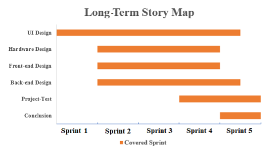

# Project Introduction
*Project Name: A Pollution Intensity Monitoring System for Residential Heating*

This project is a part of the large project behave of Climate Response Ireland. The scope of this project is defined as follows. 
- A prototype device that consists of a Raspberry Pi and gas sensors (potentially multiple sensors)
- A Python client library for sending data to and receiving command from a cloud-based server
- A design of an efficient message routing scheme for sensor data and control command transmission that can scale to multi-million devices 
- A software system for device and sensor management and sensor data visualisation

# Project Setup
## Hardware Part

### Install
you should first clone this to your raspberry 4B.
<pre>git clone https://github.com/CRI-Project/hardware-design.git</pre> 
Install the related packages by using 
<pre>pip install -r requirements.txt</pre>

# Project Implementation Process
Agile Development is used in this project. To balance the workload of this project, work is separated into five sprints where each sprint is in two-weeks long. Based on the type of work, six long-term stories are designed and distributed to these five sprints roughly (see following diagram)

  

## Project Meeting
- Technical meeting is held on every Thursday where all the technical issues are put into discussion and tested.
- Scrum meeting is held on every Thursday where the issues relating to plan is discussed and experience is shared. 
- Each scrum meeting is recorded, the problems from scrum meetings are collected and delivered to project manager in every Friday.
[Meeting Records](https://github.com/CRI-Project/related-materials/tree/main/meeting%20Records)

## Project Division
The project is divied into three parts, please see as following.
- [hardware-design part repository](https://github.com/CRI-Project/hardware-design)
- [front-end design part repository](https://github.com/CRI-Project/front-end-design)
- [back-end design part repository](https://github.com/CRI-Project/back-end-design)

## Project Summary

## Future Work
- Filter Test. In the future work, the functionality of testing filter will be implemented. 
- Report Generating. After using this system, a report can be generated automatically based on the data. 
- Data Sharing. This system will open the path of sharing data with social media. Users is allowed to share data or generated report on social media.
- Global implementation. 

# Memebrs
[@Skyer19](https://github.com/Skyer19)  
[@lihaoqiu0815](https://github.com/lihaoqiu0815) 
[@JaeScholes](https://github.com/JaeScholes) 
[@mARk-LzZ](https://github.com/mARk-LzZ)
